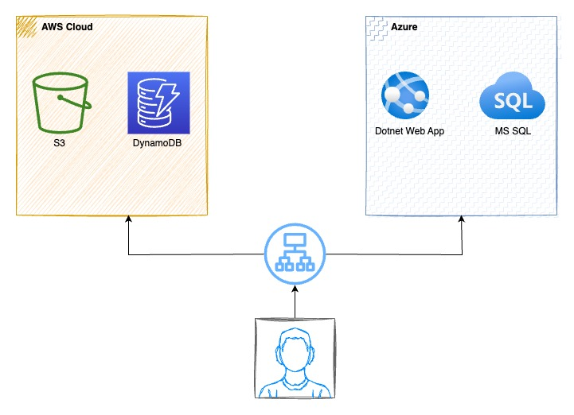

# A Multi-Cloud Application

## Getting Started

This folder contains the scaffolding Terraform code to deploy your project. Once you select the appropriate cloud providers, you will need to research specific Terraform modules for your select service and add those modules to the provided Terraform scaffolding.

### Resources

See the documentation here:

- For [Azure](https://registry.terraform.io/providers/hashicorp/azurerm/latest/docs)
- For [AWS](https://registry.terraform.io/providers/hashicorp/aws/latest/docs)

### Dependencies

```
- Terraform
- Azure access
- AWS access
```

### Installation

**NOTE:** This project assumes you have already set up your labs from the course and created your personal git copies of the repositories:

1. Open the AWS portal from the classroom
   1. Open AWS CloudShell
   2. Run the following commands to install Terraform:
      1. `sudo yum install -y yum-utils`
      2. `sudo yum-config-manager --add-repo https://rpm.releases.hashicorp.com/AmazonLinux/hashicorp.repo`
      3. `sudo yum -y install terraform`
   3. Clone your git repo
2. Open the Azure portal from the classroom
   1. Open the Azure Cloud Shell
      1. Select PowerShell when prompted. Then click Advanced Setup on the next screen
      2. You can leave the resource group selected, but you’ll need to put in a name for the storage account and file share for your console. Name your storage account all lowercase with no dashes or punctuation. And less than 24 characters. Something like tscottocloudcstorage and tscottofileshare. Then click Create. Allow the console to provision.
   2. Clone your git repo

## Project Instructions

### Requirements

Your goal is to select a cloud provider for each of the 4 required services - SQL server, S3 storage, web app and NoSQL database. Also don't forget to consider cost and flexibility of pricing options.

1. Select a cloud provider for SQL server
   1. Must utilize at least 2 vCPU
   2. 150GB of storage
   3. We will be migrating an existing SQL server instance
   4. We would like to bring our own SQL licensing
2. Select a cloud provider for S3 storage
   1. Must have full S3 API capability
   2. Global replication
3. Select a cloud provider for the NoSQL database
   1. Global availability
   2. Highly scalable pricing
4. Select a cloud provider for the Web app
   1. Existing dotnet application

### Solution

1. **Why should we choose DynamoDB?**

When it comes to the NoSQL Database, Amazon DynamoDB and Azure CosmosDB both are widely used NoSQL databases with high scalability and availability. Amazon has been using DynamoDB on its own marketplace for more than ten years.

Both databases are available globally (in all regions) and guarantee **99.99** percent availability for NoSQL data.

In DynamoDb, you are charged **$1.25** per million write request units and **$0.25** per million read request units for on-demand capacity mode. You get the first **25 GB** for free and later you are charged **$0.25** per GB-month.

In Cosmos Db for transactional data storage, you are charged **$0.05** per 10,000 writes and **$0.005** per 10,000 reads. It also costs **$0.282** per million requests that include both read and write. The storage price is similar to DynamoDb which is **$0.25 GB/month**.

2.  Here is our diagram for all 4 services.



3.  I added the appropriate modules to the given cloud provider Terraform scafolding files:

    1. AWS - `terraform/aws/main.tf`
    2. Azure - `terraform/azure/main.tf`

4.  I edited the appropriate environment variables for the containers to test my install

5.  I edit the Azure DNS for the container.
    ```
      dns_name_label      = "udacity-tscotto-azure"
    ```
6.  I completed the files with my modules.

7.  I applied my changes and pushed my code.

8.  Go to the Cloud Shell to pull a fresh copy of your github repository

9.  In each shell, I run the following:

    For AWS:

    ```
    cd multicloudnano-project/terraform/aws
    terraform apply
    ```

    For Azure:

    ```
    cd multicloudnano-project/terraform/azure
    terraform apply
    ```

10. Changes were applied in 15 mns

11. Verify the changes took effect:

    For Azure:

    1.  In Azure go the search bar and type `container-instances` and click the icon that comes up
    2.  Click `udacity-continst`
    3.  Copy the URL from the field FQDN
    4.  Paste that URL into another tab in your browser and add `:3000` onto the end of the URL. It will look something like this: `udacity-tscottoazure.westeurope.azurecontainer.io:3000`. Go to that URL. You should see this text in your browser (note the name will be yours):

                This is my app running on Azure accessing an S3 bucket in AWS: udacity-tscotto-s3-bucket

                And also accessing a dynamodb instance in AWS: udacity-tscotto-aws-dynamodb

    For AWS:

    1.  In AWS go the search bar and type `load balancer` and click Load Balancers under the EC2 heading
    2.  Click `udacity-lb`
    3.  Copy the URL from the field DNS
    4.  Paste that URL into another tab in your browser. It will look something like this: `udacity-lb-266017657.us-east-2.elb.amazonaws.com`. Go to that URL. You should see this text in your browser (note the name will be yours):

                This is my app running on AWS accessing an Azure SQL instance: tscotto-udacity-sql

                And also a dotnet app in Azure: udacity-tscotto-azure-dotnet-app

12. Please take a screenshot of a running web applications in a browser
13. Complete!
14. Clean up resources

    For AWS:

    ```
    cd cd11573-multicloud-computing-project/starter/aws
    terraform destroy
    ```

    For Azure:

    ```
    cd cd11573-multicloud-computing-project/starter/azure
    terraform destroy
    ```

    And type `yes` and press enter when asked if you want to destroy the resources

15. Please take a screenshot of the cloud console showing the successful Terraform destroy command

### Note about DynamoDB vs Cosmos DB

Both the databases support autoscaling — provisioned and on-demand. However, Cosmos DB has a request unit to interact with the database that consists of reading and writing both and you scale that unit. But on the other hand in the DynamoDB read and write unit both are separate (this is important if your application will have more reads/writes than writes/reads).

## License

[License](LICENSE.txt)
